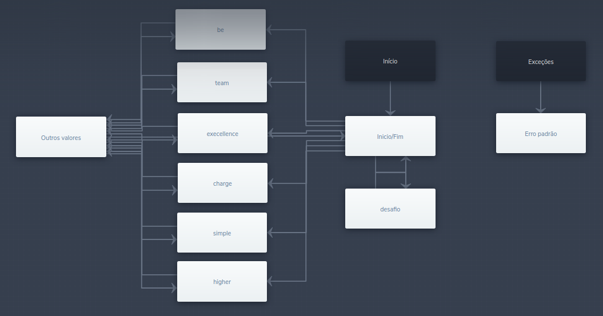

## API com integração a blip com dados do API Github
### Processo seletivo para take.net de estágio de desenvolvimento - API da Github integrada com bot da Blip


**Chatbot feito no blip:** 

**Chatbot no meu site curriculo:** 

**API no Heroku:** ![API](https://api-take.herokuapp.com/dados/{N}}

> N = posição do objeto no array.
> EX: https://api-take.herokuapp.com/dados/1

```
{
full_name: "takenet/library.logging",


description: "Provides a simple logging interface for applications and some basic implementations of this interface",

created_at: "2013-10-25T15:18:07Z"
}
```


### Imagem do builder



---

- [x] Vídeo de apresentação :D
- [x] Fazer chatbot e usar API do Github
- [ ] Carregando....

Uma atividade muito boa e interessante de se por em prática[^1]

[^1]: E não vai ser a última.
